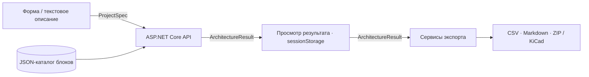

# PCB Copilot

**От требований к плате — к архитектуре, перечню компонентов и инженерному отчёту.**

PCB Copilot — pet-проект на C# и TypeScript для подготовки черновика промышленного контроллера на STM32. Пользователь задаёт требования через форму или текстовое описание, а приложение подбирает функциональные блоки, составляет предварительный перечень компонентов и показывает вопросы, которые нужно решить перед разработкой схемы в KiCad.

Проект охватывает пользовательский сценарий от ввода требований до экспорта файлов. Текущая реализация — MVP с локальным запуском и генерацией по заданным правилам.

**Стек:** ASP.NET Core / .NET 8 · Next.js 16 · React 19 · TypeScript · JSON · Swagger

[Возможности](#возможности) · [Демонстрация](#демонстрационный-сценарий) · [Запуск](#быстрый-старт) · [Архитектура](#архитектура) · [Планы](#планы-развития)

## Возможности

- **Два способа ввода:** структурированная форма и разбор русского текстового описания локальными правилами.
- **Проверка требований:** обязательные поля, размеры платы, число слоёв и базовые условия питания STM32.
- **Подбор архитектуры:** выбор из 11 типов функциональных блоков с объяснением, какое требование привело к добавлению каждого блока.
- **Предварительный BoM** — Bill of Materials, перечень компонентов с номиналами, корпусами, посадочными местами и количествами. Повторяемые входные и релейные блоки учитываются в количестве компонентов.
- **Инженерный обзор:** недостающие параметры, приоритеты рисков, предварительный обзор питания и GPIO, решения инженера и следующие шаги.
- **Экспорт:** BoM в CSV, отчёт в Markdown и ZIP с требованиями, отчётом и стартовыми файлами KiCad.

Результат предназначен для дальнейшей инженерной проработки. Схема, соединения, размещение компонентов и трассировка автоматически не создаются.

## Демонстрационный сценарий

Базовая конфигурация уже заполнена на странице создания проекта:

| Параметр | Значение |
| --- | --- |
| Устройство | Промышленный контроллер |
| Входное питание | 24 В DC с защитой от переполюсовки |
| Внутренние линии | 5 В и 3,3 В |
| Микроконтроллер | STM32, программирование через SWD |
| Интерфейс | RS-485 |
| Ввод и вывод | 4 дискретных входа 24 В, 2 релейных выхода |
| Индикация | Питание, состояние, обмен данными |
| Плата | 80 × 60 мм, 2 слоя |

После [локального запуска](#быстрый-старт):

1. Откройте [страницу создания проекта](http://127.0.0.1:3000/new-project).
2. Используйте заполненную форму или переключитесь на «Текстовое описание» и вставьте пример ниже.
3. Нажмите «Разобрать описание», если используете текстовый ввод, и проверьте поля формы.
4. Нажмите «Сформировать архитектуру».
5. Изучите вкладки «Обзор», «Риски», «Что уточнить», «Питание и GPIO», «Узлы платы», «Перечень элементов» и «Проверки».
6. На вкладке «Экспорт» скачайте CSV, сформируйте Markdown-отчёт или скачайте ZIP проекта.

```text
Нужна плата промышленного контроллера на STM32. Питание 24 В,
интерфейс RS-485, четыре дискретных входа 24 В, два релейных выхода,
размер платы 80 на 60 мм, 2 слоя.
```

Парсер извлекает знакомые параметры и обновляет соответствующие поля формы. Остальные значения формы сохраняются. Внешние AI-сервисы и API-ключи для этого не нужны.

## Быстрый старт

### Требования

- .NET **8 SDK** для сборки и запуска API.
- Node.js **20.9 или новее** и npm для frontend.
- Доступ к NuGet и npm registry при первой установке зависимостей.

База данных и установленный KiCad для запуска веб-приложения не требуются.

Команды ниже рассчитаны на PowerShell. Откройте два терминала **в корне репозитория**.

### 1. Backend

```powershell
cd backend
dotnet restore
dotnet run --urls http://127.0.0.1:5065
```

`dotnet run` собирает приложение перед запуском. API и его интерактивная документация доступны в [Swagger UI](http://127.0.0.1:5065/swagger).

### 2. Frontend

Во втором терминале:

```powershell
cd frontend
npm ci
$env:NEXT_PUBLIC_API_BASE_URL = "http://127.0.0.1:5065"
npm run dev -- --hostname 127.0.0.1 --port 3000
```

Откройте [PCB Copilot](http://127.0.0.1:3000).

Используйте именно `127.0.0.1:3000`: текущая CORS-политика backend разрешает этот origin. Открытие frontend через `localhost:3000` или другой порт потребует изменения политики. Переменную API нужно задавать в том же терминале, где запускается frontend.

### Сборка

Из корня репозитория после установки зависимостей:

```powershell
dotnet build backend/PcbCopilot.Backend.csproj -c Release
$env:NEXT_PUBLIC_API_BASE_URL = "http://127.0.0.1:5065"
npm --prefix frontend run build
```

Запуск собранного frontend:

```powershell
npm --prefix frontend run start -- --hostname 127.0.0.1 --port 3000
```

Backend запускается отдельно. Для подготовки его файлов к развёртыванию предусмотрена команда `dotnet publish backend/PcbCopilot.Backend.csproj -c Release`.

## Архитектура

Frontend и backend — отдельные приложения с HTTP/JSON-контрактом. Центральные модели: `ProjectSpec` описывает требования, `ArchitectureResult` объединяет результат генерации.



Frontend сначала вызывает валидацию и при отсутствии ошибок отправляет отдельный запрос генерации. Backend выбирает блоки из каталога, формирует BoM, предупреждения и инженерный анализ. Результат сохраняется в `sessionStorage` для перехода на страницу просмотра; при экспорте frontend передаёт его обратно API.

### Технические решения

| Решение | Как реализовано |
| --- | --- |
| Разделение HTTP и бизнес-логики | Minimal API endpoints связывают запросы и ответы с сервисами; зависимости регистрируются через DI |
| Генерация по правилам | C#-сервисы выбирают блоки и строят результат без внешних API |
| Каталог компонентов | JSON хранит состав блоков, количества и стандартные предупреждения; правила выбора находятся в C# |
| Независимая модель результата | `ArchitectureResult` используется интерфейсом и экспортерами CSV, Markdown и ZIP |
| Организация frontend | App Router, страницы-контейнеры, компоненты результата и единый API-клиент |
| Типизация | C# records и TypeScript-типы; nullable-анализ в backend и strict-режим TypeScript |

### Где находится логика

- [ProjectValidator.cs](backend/Services/ProjectValidator.cs) — базовая проверка требований.
- [ArchitectureGenerator.cs](backend/Services/ArchitectureGenerator.cs) — выбор блоков, BoM, предупреждения и проверки результата.
- [EngineeringReviewGenerator.cs](backend/Services/EngineeringReviewGenerator.cs) — обоснования, риски, ресурсы и следующие шаги.
- [FunctionalBlockCatalog.cs](backend/Services/FunctionalBlockCatalog.cs) — загрузка JSON-каталога и поиск блоков.
- [ProjectPackageExporter.cs](backend/Services/ProjectPackageExporter.cs) — сборка ZIP с использованием отдельных экспортеров CSV и Markdown.
- [requirements-parser.ts](frontend/src/lib/requirements-parser.ts) — разбор текстового описания в браузере.

## Структура репозитория

```text
pcb-copilot/
├── backend/
│   ├── Data/              # JSON-каталог функциональных блоков
│   ├── Endpoints/         # HTTP endpoints
│   ├── Infrastructure/    # Регистрация сервисов и CORS
│   ├── Models/            # Требования, результат, BoM и инженерный анализ
│   ├── Services/          # Валидация, генерация и экспорт
│   └── Program.cs         # Точка входа API
├── frontend/
│   └── src/
│       ├── app/           # Главная, создание проекта, результат
│       ├── components/    # Компоненты интерфейса результата
│       ├── lib/           # API, парсер, хранение и скачивание файлов
│       └── types/         # TypeScript-модели API
└── docs/                  # Описание продукта и ручные проверки
```

## Что входит в экспорт

CSV содержит позиции, наименования, типы, номиналы, корпуса, footprint, количества и комментарии. Markdown-отчёт объединяет требования, выбранные блоки, BoM, предупреждения и инженерный анализ.

ZIP собирает артефакты в один пакет:

```text
project-spec.json
bom.csv
engineering-report.md
kicad/
├── README-KiCad.md
├── industrial-stm32-controller.kicad_pro
├── industrial-stm32-controller.kicad_sch
└── industrial-stm32-controller.kicad_pcb
```

KiCad-файлы — стартовые заготовки: схема содержит текстовые пояснения, а плата — прямоугольный контур по заданным размерам. Полноценная схема, назначение компонентов и трассировка остаются следующим этапом разработки.

## Текущие ограничения

- Библиотека и правила ориентированы на базовый сценарий STM32 + 24 В + RS-485. Поддержка произвольных микроконтроллеров, интерфейсов и схем питания пока не реализована.
- Текстовый ввод использует регулярные выражения: сложные формулировки и отрицания могут разбираться неверно. Перед генерацией нужно проверить поля формы.
- Обзор питания и GPIO предварительный. Токи не рассчитываются, итоговая оценка GPIO пока привязана к базовому сценарию.
- В BoM есть позиции, требующие выбора конкретной модели и номинала. Проверка footprint проверяет заполнение поля, а не наличие и корректность посадочного места в KiCad.
- Проекты хранятся только в `sessionStorage`. База данных, история проектов и авторизация пока отсутствуют.
- Автоматические тесты и CI пока не добавлены. Для ручной проверки есть [чек-лист](docs/manual-test-checklist.md).

> Результат является инженерным черновиком. Перед изготовлением платы требуются выбор и проверка компонентов, разработка схемы, ERC/DRC и проверка электрических, тепловых и механических ограничений.

## Планы развития

- [ ] Сделать серверную валидацию обязательной частью генерации и явно обрабатывать неподдерживаемые требования.
- [ ] Добавить автоматические тесты валидатора, выбора блоков, текстового парсера и экспорта.
- [ ] Рассчитывать GPIO по выбранной конфигурации и расширить модель данными для расчёта питания.
- [ ] Добавить сохранение проектов и повторное редактирование требований.
- [ ] Развить KiCad-экспорт до схем с компонентами и соединениями на основе проверенных шаблонов.
- [ ] Настроить CI для сборки и проверок, подготовить контейнерный запуск.

## Документация

| Документ | Содержание |
| --- | --- |
| [Backend](backend/README.md) | Запуск API, endpoints, модели и сервисы |
| [Frontend](frontend/README.md) | Запуск интерфейса, настройка API и организация кода |
| [Ручные проверки](docs/manual-test-checklist.md) | Сценарии проверки ввода, результата и экспорта |
| [Концепция продукта](docs/product-brief.md) | Назначение проекта и целевая аудитория |
| [Исходные границы MVP](docs/mvp-scope.md) | План первого этапа разработки |
| [Описание блоков](docs/blocks.md) | Назначение функциональных узлов и инженерные замечания |

Документы в `docs/` также содержат проектные планы. Фактический HTTP-контракт задают [endpoints](backend/Endpoints/ProjectEndpoints.cs), [C#-модели](backend/Models/) и Swagger запущенного API.
